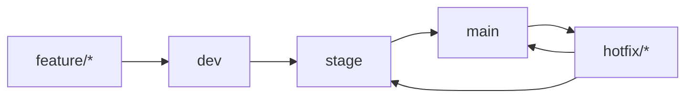

# Metodología ágil y estrategia de branching

Este proyecto se organiza con una variante ligera de **Kanban con entregas por iteraciones**. La prioridad fue mantener flujo continuo de trabajo, reducir dependencias entre servicios y dejar evidencia clara de avance por versión.

## Metodología de trabajo

- **Backlog**: historias de usuario, mejoras técnicas, deuda técnica y tareas de documentación.
- **Planificación**: trabajo en bloques cortos con objetivos concretos por iteración.
- **Ejecución**: cada bloque termina con validación técnica y actualización de documentación.
- **Revisión**: se registran cambios funcionales, riesgos y tareas pendientes.

## Estrategia de branching

Se usa una estrategia parecida a **GitFlow simplificado**:

- `main`: versión estable para release y validación final.
- `stage`: rama de integración previa a producción.
- `dev`: rama de desarrollo continuo.
- `feature/*`: ramas cortas para cambios aislados.
- `hotfix/*`: correcciones urgentes sobre ramas estables.

## Flujo recomendado

## Sistema de gestión sugerido

Para documentar avance y mantener trazabilidad se puede usar cualquiera de estas opciones:

- GitHub Projects
- Jira
- Trello

La estructura mínima recomendada es:

- **Epics** por gran área: backend, frontend, infraestructura, pruebas y documentación.
- **Historias de usuario** con criterios de aceptación.
- **Tareas técnicas** para implementación y validación.

## Iteraciones completas

Se documentan al menos dos iteraciones completas:

### Iteración 1

- Base de microservicios y contratos API.
- Pipeline inicial de integración.
- Infraestructura mínima y despliegue de desarrollo.

### Iteración 2

- Endurecimiento del CI/CD.
- Pruebas E2E, rendimiento y evidencias.
- Mejoras de observabilidad, seguridad y documentación.

## Ejemplo de historia de usuario

**Como** operador de la plataforma
**Quiero** desplegar una rama de desarrollo en un ambiente aislado
**Para** validar cambios sin afectar stage o producción

### Criterios de aceptación

- El despliegue se realiza en el ambiente correcto.
- La pipeline ejecuta pruebas relevantes antes de publicar artefactos.
- El teardown deja el ambiente en estado reutilizable.
- La ejecución queda registrada en artefactos y logs.
