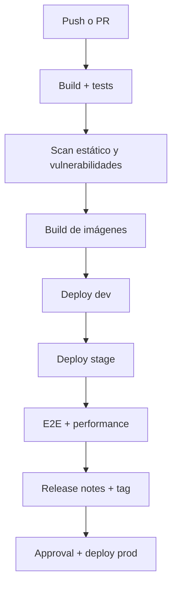

# CI/CD avanzado

Esta guía resume la estrategia de CI/CD aplicada al repositorio y los componentes que conviene documentar para la entrega.

## Objetivos

- Separar ambientes `dev`, `stage` y `prod`.
- Promover cambios de forma controlada.
- Registrar evidencias de build, tests y despliegue.
- Reducir fallos repetitivos con validaciones automáticas.

## Flujo general

## Piezas ya documentadas o implementadas

- Pipeline principal en `Jenkinsfile`.
- Tests de integración, E2E y performance.
- Artefactos de logs y resultados.
- Promoción por rama.
- Teardown diferido para reutilizar entornos.

## Mejoras recomendadas para completar la rúbrica

### SonarQube

- Agregar análisis estático por módulo.
- Publicar quality gate antes de pasar a stage.

### Trivy

- Escaneo de imágenes antes de publicar.
- Fallar la pipeline si aparecen vulnerabilidades críticas.

### Notificaciones

- Correo o chat al fallar un stage crítico.
- Resumen de resultado al terminar el pipeline.

### Aprobaciones

- Requerir aprobación explícita para `main` antes del despliegue productivo.

## Release control

- Crear tags automáticos por release.
- Generar notas a partir del historial de commits.
- Mantener trazabilidad entre commit, build e imagen.

## Observación operativa

Si una parte del pipeline falla, conviene que el resto siga solo cuando el stage sea independiente y no comprometa el despliegue final. Esa regla ya se usó en el pipeline para pruebas y evidencias.
