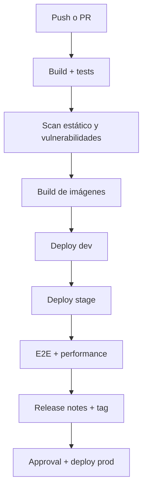

# CI/CD avanzado

Esta guía resume la estrategia de CI/CD aplicada al repositorio y los componentes que conviene documentar para la entrega.

## Objetivos

- Separar ambientes `dev`, `stage` y `prod`.
- Promover cambios de forma controlada.
- Registrar evidencias de build, tests y despliegue.
- Reducir fallos repetitivos con validaciones automáticas.

## Flujo general

## Piezas ya documentadas o implementadas

- Pipeline principal en `Jenkinsfile`.
- Tests de integración, E2E y performance.
- Artefactos de logs y resultados.
- Promoción por rama.
- Teardown diferido para reutilizar entornos.

## Mejoras recomendadas para completar la rúbrica

### SonarQube

- Análisis estático desde el pipeline (stage "Static Analysis (SonarQube)").
- Se ejecuta si existen `SONAR_HOST_URL` y `SONAR_TOKEN`.
- Se deja el stage en UNSTABLE si falla el análisis.

### Trivy

- Escaneo de imágenes con `scripts/ci/run-trivy.sh`.
- Reportes JSON y TXT archivados por build.
- En la pipeline, las vulnerabilidades críticas dejan el stage en estado UNSTABLE.

### Notificaciones

- Webhook en fallos o inestabilidad con `scripts/ci/notify-webhook.sh`.
- Variable requerida: `PIPELINE_WEBHOOK_URL`.

### Aprobaciones

- Requerir aprobación explícita para `main` antes del despliegue productivo.

### Versionado semántico automático

- Script: `scripts/ci/semver-from-git.sh`
- Output: `build/semver.txt` (archivado)
- Se calcula en cada ejecución a partir de commits y tags.

## Release control

- Crear tags automáticos por release.
- Generar notas a partir del historial de commits.
- Mantener trazabilidad entre commit, build e imagen.

## Observación operativa

Si una parte del pipeline falla, conviene que el resto siga solo cuando el stage sea independiente y no comprometa el despliegue final. Esa regla ya se usó en el pipeline para pruebas y evidencias.
