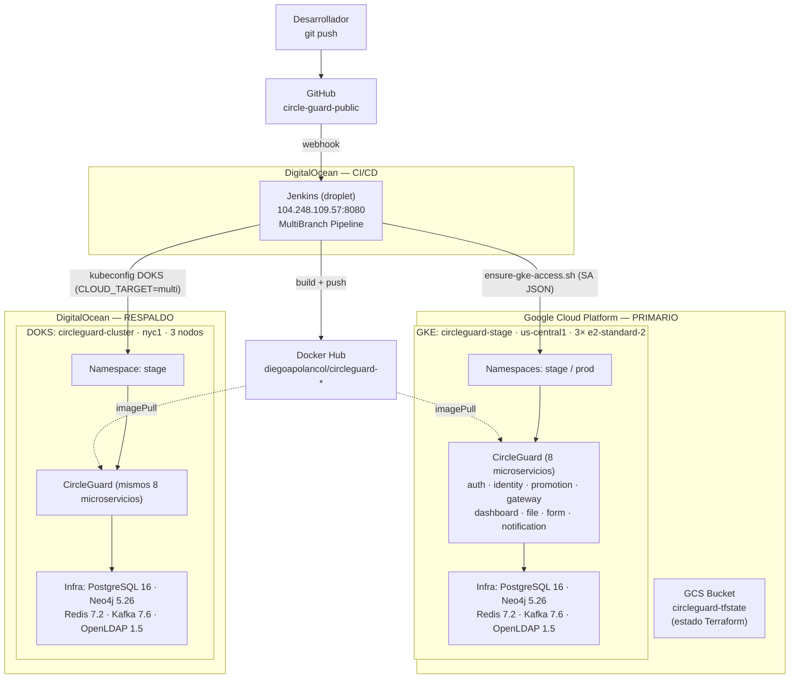
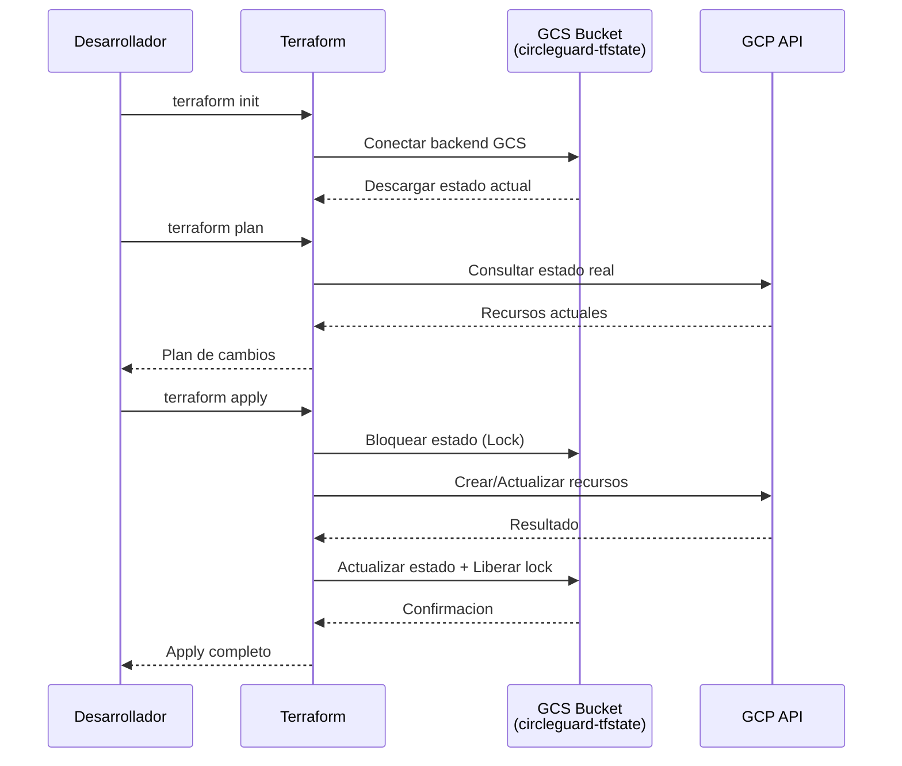

# Arquitectura de Infraestructura – CircleGuard

## 1. Diagrama de Arquitectura General

> Este diagrama refleja la **infraestructura realmente en ejecución** (verificada en junio 2026):
> CI/CD en un droplet de DigitalOcean, despliegue **multi-cloud** a GKE (primario) y DOKS
> (respaldo) mediante el pipeline `CLOUD_TARGET=multi`. La topología modular completa por
> ambiente que define el código Terraform se describe en las secciones 2, 5 y 6.



### 1.2 Detalle multi-cloud

| Rol | Proveedor | Cluster | Región | Nodos |
|-----|-----------|---------|--------|-------|
| **Primario** | GCP (GKE) | `circleguard-stage` | `us-central1` | 3× e2-standard-2 |
| **Respaldo** | DigitalOcean (DOKS) | `circleguard-cluster` | `nyc1` | 3× s-2vcpu-4gb |

El pipeline (`CLOUD_TARGET=multi`) despliega primero a GCP y luego a DigitalOcean en la misma
corrida. Estrategia de respaldo y balanceo entre nubes: ver `docs/MULTICLOUD_GCP_DO.md`.

---

## 2. Estructura de Terraform (Modular)

```mermaid
graph TD
    subgraph "infra/terraform-gcp/"
        ENV_DEV["environments/dev/<br/>main.tf + terraform.tfvars"]
        ENV_STG["environments/stage/<br/>main.tf + terraform.tfvars"]
        ENV_PROD["environments/prod/<br/>main.tf + terraform.tfvars"]
        GLOBAL["global/<br/>main.tf<br/>(bootstrap state bucket)"]

        subgraph "modules/"
            VPC["vpc/<br/>VPC, Subnets,<br/>Firewall Rules"]
            COMPUTE["compute/<br/>VMs, Static IPs,<br/>Startup Scripts"]
            RS["remote-state/<br/>GCS Bucket +<br/>Versioning"]
        end

        ENV_DEV --> VPC
        ENV_DEV --> COMPUTE
        ENV_DEV --> RS
        ENV_STG --> VPC
        ENV_STG --> COMPUTE
        ENV_PROD --> VPC
        ENV_PROD --> COMPUTE
        GLOBAL --> RS
    end

    subgraph "infra/terraform/"
        K8S_DEV["environments/dev/<br/>main.tf"]
        K8S_STG["environments/stage/<br/>main.tf"]
        K8S_PROD["environments/prod/<br/>main.tf"]

        subgraph "modules/"
            DS["docker-secret/<br/>Docker Hub Pull Secret"]
        end

        K8S_DEV --> DS
        K8S_STG --> DS
        K8S_PROD --> DS
    end

    subgraph "infra/terraform-do/"
        DO_DEV["environments/dev/<br/>main.tf + backend.hcl"]
        DO_STG["environments/stage/<br/>main.tf + backend.hcl"]
        DO_PROD["environments/prod/<br/>main.tf + backend.hcl"]

        subgraph "modules/"
            DO_VPC_M["vpc/<br/>VPC DO"]
            DO_DOKS_M["doks-cluster/<br/>DOKS Cluster"]
        end

        DO_DEV --> DO_VPC_M
        DO_DEV --> DO_DOKS_M
        DO_STG --> DO_VPC_M
        DO_STG --> DO_DOKS_M
        DO_PROD --> DO_VPC_M
        DO_PROD --> DO_DOKS_M
    end
```



---

## 3. Flujo de Estado Remoto (GCS Backend)



### 3.2 Estado remoto en DigitalOcean (Spaces)

- Bucket: `circleguard-tfstate-do`
- Prefijos: `terraform-do/dev`, `terraform-do/stage`, `terraform-do/prod`
- Backend tipo `s3` con endpoint de Spaces

---

## 4. Modulos de Terraform

### 4.1 Modulo `vpc`

| Recurso | Descripcion |
|---------|-------------|
| `google_compute_network` | Red VPC |
| `google_compute_subnetwork` | Subred por ambiente |
| `google_compute_firewall.allow_ssh` | SSH (puerto 22) |
| `google_compute_firewall.allow_jenkins` | Jenkins (puerto 8080) |
| `google_compute_firewall.allow_http_https` | HTTP/HTTPS (80, 443) |
| `google_compute_firewall.allow_internal` | Trafico interno en la VPC |

### 4.2 Modulo `compute`

| Recurso | Descripcion |
|---------|-------------|
| `google_compute_address` | IP publica estatica por VM |
| `google_compute_instance` | Instancias VM con startup scripts |

### 4.3 Modulo `remote-state`

| Recurso | Descripcion |
|---------|-------------|
| `google_storage_bucket` | Bucket GCS con versioning para estado Terraform |
| `google_storage_bucket_iam_member` | Permisos de administrador al bucket |

### 4.4 Modulo `docker-secret`

| Recurso | Descripcion |
|---------|-------------|
| `kubernetes_secret_v1` | Secret de tipo dockerconfigjson en cada namespace |

---

## 5. Ambientes

### 5.1 Topología definida en Terraform (IaC)

El código Terraform define una estructura modular por ambiente. En GCP, cada ambiente
provisiona **VPC + cluster GKE** (módulo `gke`) **+ VMs de cómputo** (módulo `compute`):

| Ambiente | Subred CIDR | Recursos GCP (módulos) | GCS State Prefix |
|----------|-------------|------------------------|------------------|
| **dev** | `10.20.0.0/24` | VPC + GKE + VMs (40/30 GB) | `terraform-gcp/dev` |
| **stage** | `10.20.10.0/24` | VPC + GKE + VMs (40/30 GB) | `terraform-gcp/stage` |
| **prod** | `10.20.20.0/24` | VPC + GKE + VMs (50/40 GB) | `terraform-gcp/prod` |

En DigitalOcean, cada ambiente provisiona **VPC + DOKS**; el nombre del cluster es
parametrizable vía `var.cluster_name`:

| Ambiente | VPC CIDR | Cluster (`var.cluster_name`) | State Prefix |
|----------|----------|------------------------------|--------------|
| **dev** | `10.30.0.0/20` | parametrizable | `terraform-do/dev` |
| **stage** | `10.30.16.0/20` | parametrizable | `terraform-do/stage` |
| **prod** | `10.30.32.0/20` | parametrizable | `terraform-do/prod` |

### 5.2 Estado realmente desplegado (junio 2026)

| Componente | Detalle |
|------------|---------|
| **CI/CD** | Jenkins en droplet de **DigitalOcean** — `104.248.109.57:8080` (MultiBranch Pipeline) |
| **GCP — primario** | GKE `circleguard-stage` · `us-central1` · 3× e2-standard-2 · namespaces `stage`/`prod` · proyecto `project-61c89277-1b90-444b-bc4` |
| **DigitalOcean — respaldo** | DOKS `circleguard-cluster` · `nyc1` · 3× s-2vcpu-4gb · namespace `stage` |
| **Registro de imágenes** | Docker Hub — `diegoapolancol/circleguard-*` |
| **Estado Terraform** | GCS `circleguard-tfstate-<project>` (GCP) · Spaces (DO) |

El despliegue a ambas nubes en una sola corrida se hace con el pipeline `CLOUD_TARGET=multi`
(verificado: build #42 de la rama `main` = SUCCESS).

---

## 6. Backend Remoto

El estado de Terraform se almacena en un **bucket GCS** con las siguientes caracteristicas:

- **Bucket**: `circleguard-tfstate-<suffix>`
- **Ubicacion**: US (multi-region)
- **Versioning**: Habilitado (historial de cambios)
- **Lifecycle**: Elimina versiones antiguas despues de 5 versiones
- **IAM**: Solo service accounts con `roles/storage.objectAdmin`

Cada ambiente y cada proyecto de Terraform usa un **prefix** distinto dentro del mismo bucket para mantener los estados separados y evitar conflictos:

| Proyecto | Prefix |
|----------|--------|
| GCP Infra - dev | `terraform-gcp/dev` |
| GCP Infra - stage | `terraform-gcp/stage` |
| GCP Infra - prod | `terraform-gcp/prod` |
| K8s Config - dev | `terraform-k8s/dev` |
| K8s Config - stage | `terraform-k8s/stage` |
| K8s Config - prod | `terraform-k8s/prod` |
| DO Infra - dev | `terraform-do/dev` |
| DO Infra - stage | `terraform-do/stage` |
| DO Infra - prod | `terraform-do/prod` |

---

## 7. Bootstrap del Bucket de Estado

Antes de usar los entornos, se debe crear el bucket de estado ejecutando:

```bash
cd infra/terraform-gcp/global
cp terraform.tfvars.example terraform.tfvars
# Editar terraform.tfvars con los valores del proyecto
terraform init
terraform apply
```

Luego, en cada entorno:

```bash
cd infra/terraform-gcp/environments/dev  # o stage, prod
terraform init
terraform plan
terraform apply
```

---

## 8. Seguridad

**A nivel de infraestructura (Terraform / red):**

- Las VMs y reglas de firewall solo exponen puertos esenciales (22, 8080, 80, 443)
- SSH restringido por CIDR configurable; tráfico interno permitido dentro de la VPC
- Estado de Terraform en GCS con versioning e IAM restringido (solo service accounts con `roles/storage.objectAdmin`)
- Claves SSH inyectadas vía metadata, no hardcodeadas

**A nivel de cluster y aplicación (lo desplegado):**

- Credenciales (SA de GCP, kubeconfig de DOKS, Docker Hub, `QR_SECRET`) gestionadas como **credenciales de Jenkins**, nunca en el repositorio
- **RBAC** con ServiceAccounts de permisos mínimos (`k8s/base/rbac.yaml`)
- **Network Policies** que restringen el tráfico entre pods (`k8s/base/network-policies.yaml`)
- **TLS** vía cert-manager + ClusterIssuer (`k8s/tls/`)
- **mTLS STRICT** entre servicios con Istio (`k8s/mesh/peer-authentication.yaml`)
- Escaneo continuo con **Trivy** (imágenes) y **OWASP ZAP** (dinámico) en el pipeline
- `realIdentity` cifrado a nivel de columna en la base de datos (`IdentityEncryptionConverter`)
