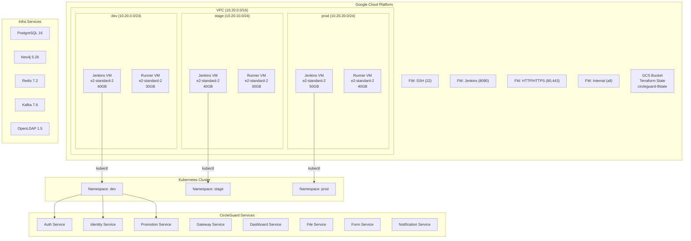
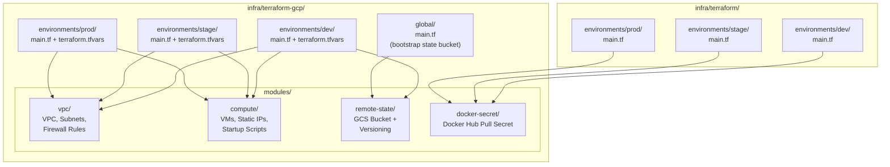
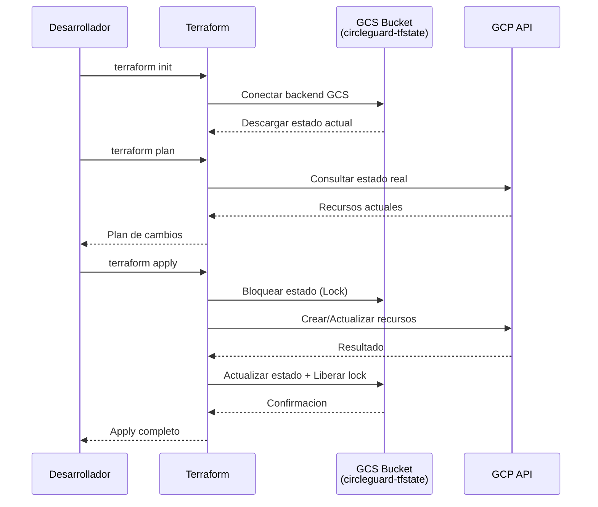

# Arquitectura de Infraestructura – CircleGuard

## 1. Diagrama de Arquitectura General



---

## 2. Estructura de Terraform (Modular)



---

## 3. Flujo de Estado Remoto (GCS Backend)



---

## 4. Modulos de Terraform

### 4.1 Modulo `vpc`

| Recurso | Descripcion |
|---------|-------------|
| `google_compute_network` | Red VPC |
| `google_compute_subnetwork` | Subred por ambiente |
| `google_compute_firewall.allow_ssh` | SSH (puerto 22) |
| `google_compute_firewall.allow_jenkins` | Jenkins (puerto 8080) |
| `google_compute_firewall.allow_http_https` | HTTP/HTTPS (80, 443) |
| `google_compute_firewall.allow_internal` | Trafico interno en la VPC |

### 4.2 Modulo `compute`

| Recurso | Descripcion |
|---------|-------------|
| `google_compute_address` | IP publica estatica por VM |
| `google_compute_instance` | Instancias VM con startup scripts |

### 4.3 Modulo `remote-state`

| Recurso | Descripcion |
|---------|-------------|
| `google_storage_bucket` | Bucket GCS con versioning para estado Terraform |
| `google_storage_bucket_iam_member` | Permisos de administrador al bucket |

### 4.4 Modulo `docker-secret`

| Recurso | Descripcion |
|---------|-------------|
| `kubernetes_secret_v1` | Secret de tipo dockerconfigjson en cada namespace |

---

## 5. Ambientes

| Ambiente | Subred CIDR | VMs | GCS State Prefix |
|----------|-------------|-----|------------------|
| **dev** | `10.20.0.0/24` | Jenkins (40GB) + Runner (30GB) | `terraform-gcp/dev` |
| **stage** | `10.20.10.0/24` | Jenkins (40GB) + Runner (30GB) | `terraform-gcp/stage` |
| **prod** | `10.20.20.0/24` | Jenkins (50GB) + Runner (40GB) | `terraform-gcp/prod` |

---

## 6. Backend Remoto

El estado de Terraform se almacena en un **bucket GCS** con las siguientes caracteristicas:

- **Bucket**: `circleguard-tfstate-<suffix>`
- **Ubicacion**: US (multi-region)
- **Versioning**: Habilitado (historial de cambios)
- **Lifecycle**: Elimina versiones antiguas despues de 5 versiones
- **IAM**: Solo service accounts con `roles/storage.objectAdmin`

Cada ambiente y cada proyecto de Terraform usa un **prefix** distinto dentro del mismo bucket para mantener los estados separados y evitar conflictos:

| Proyecto | Prefix |
|----------|--------|
| GCP Infra - dev | `terraform-gcp/dev` |
| GCP Infra - stage | `terraform-gcp/stage` |
| GCP Infra - prod | `terraform-gcp/prod` |
| K8s Config - dev | `terraform-k8s/dev` |
| K8s Config - stage | `terraform-k8s/stage` |
| K8s Config - prod | `terraform-k8s/prod` |

---

## 7. Bootstrap del Bucket de Estado

Antes de usar los entornos, se debe crear el bucket de estado ejecutando:

```bash
cd infra/terraform-gcp/global
cp terraform.tfvars.example terraform.tfvars
# Editar terraform.tfvars con los valores del proyecto
terraform init
terraform apply
```

Luego, en cada entorno:

```bash
cd infra/terraform-gcp/environments/dev  # o stage, prod
terraform init
terraform plan
terraform apply
```

---

## 8. Seguridad

- Las VMs solo exponen puertos esenciales (22, 8080, 80, 443)
- SSH restringido por CIDR configurable
- Trafico interno permitido dentro de la VPC
- Estado de Terraform en GCS con versioning y IAM restringido
- Secrets de Docker Hub manejados como variables sensibles en Terraform
- Claves SSH inyectadas via metadata, no hardcodeadas
