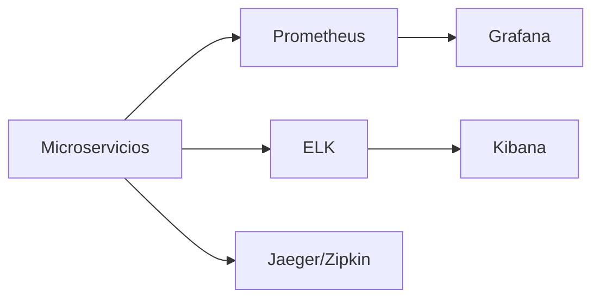

# Observabilidad y seguridad

Este documento resume la base mínima que debería presentarse para observabilidad, monitoreo y seguridad del sistema.

## Observabilidad

### Stack sugerido

- **Prometheus** para métricas.
- **Grafana** para dashboards.
- **ELK** para logs centralizados.
- **Jaeger o Zipkin** para tracing distribuido.

### Diagrama lógico

### Métricas recomendadas

- Latencia p95 por endpoint.
- Tasa de error por servicio.
- Throughput por ambiente.
- Uso de CPU, memoria y pod restarts.
- Métricas de negocio como validaciones QR, promociones de estado y notificaciones enviadas.

## Seguridad

### Controles mínimos

- Gestión de secretos por credenciales de Jenkins o Kubernetes secrets.
- RBAC por namespace y por rol.
- TLS para servicios expuestos públicamente.
- Escaneo continuo de vulnerabilidades de imágenes y dependencias.

### Buenas prácticas de secretos

- Nunca guardar llaves o tokens en texto plano en el repo.
- Usar variables inyectadas por pipeline o secret files.
- Rotar credenciales sensibles si cambian los entornos.

### Health checks

- `livenessProbe` para detectar procesos colgados.
- `readinessProbe` para evitar tráfico a pods no listos.
- `startupProbe` para servicios con arranque lento.

## Relación con pruebas

- Las pruebas E2E validan el flujo de negocio completo.
- Locust valida estabilidad bajo carga.
- Escaneos de seguridad deben acompañar cada build estable.

## Qué mostrar en la presentación

- Dashboard de latencia y errores.
- Logs de un flujo completo.
- Evidencia de health checks activos.
- Captura del escaneo de vulnerabilidades.
