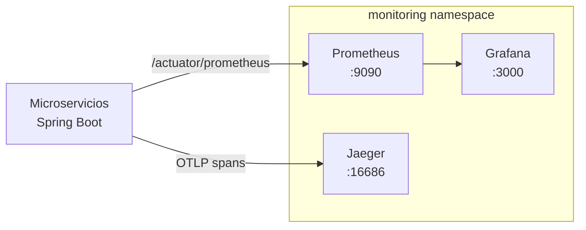

# Observabilidad y seguridad

Este documento describe el stack de observabilidad desplegado y los controles de seguridad implementados.

## Stack de observabilidad implementado

Los manifiestos viven en `k8s/monitoring/` y se aplican con:

```bash
kubectl apply -k k8s/monitoring/
# o en pipeline:
scripts/ci/k8s-deploy-monitoring.sh
```

### Prometheus (`k8s/monitoring/prometheus.yaml`)

- Versión: `prom/prometheus:v2.51.2`
- Namespace: `monitoring`
- ServiceAccount + ClusterRole para descubrimiento automático de pods en `dev`, `stage` y `prod`
- Scrape cada 30 s contra `/actuator/prometheus` de todos los pods con label `app: circleguard-*`
- Retención: 7 días

Métricas expuestas por cada servicio Spring Boot (via Micrometer):
- `http_server_requests_seconds` — latencia y tasa de peticiones
- `jvm_memory_used_bytes` — heap / non-heap
- `resilience4j_circuitbreaker_state` — estado del Circuit Breaker (auth-service)
- `process_cpu_usage`, `system_cpu_usage`

### Grafana (`k8s/monitoring/grafana.yaml`)

- Versión: `grafana/grafana:10.4.2`
- Datasource provisionado automáticamente apuntando a Prometheus
- Dashboard **CircleGuard Services** (`uid: circleguard-overview`) con:
  - Contador de servicios activos
  - Request rate (rps) por servicio
  - Latencia p95 (ms)
  - JVM Heap por instancia
  - Error rate (4xx / 5xx)
  - Estado del Circuit Breaker

Acceso local después del despliegue:
```bash
kubectl -n monitoring port-forward svc/grafana 3000:3000
# http://localhost:3000  usuario: admin  password: circleguard
```

### Jaeger — tracing distribuido (`k8s/monitoring/jaeger.yaml`)

- Versión: `jaegertracing/all-in-one:1.56`
- OTLP habilitado (gRPC 4317, HTTP 4318) para recibir spans de servicios Spring Boot
- UI en puerto 16686
- Almacenamiento en memoria (suficiente para demos y stage)

Acceso local:
```bash
kubectl -n monitoring port-forward svc/jaeger 16686:16686
# http://localhost:16686
```

### Diagrama lógico



## RBAC Kubernetes (`k8s/base/rbac.yaml`)

Cada namespace (`dev`, `stage`, `prod`) tiene:
- **ServiceAccount** `circleguard-app` — usado por los pods de los microservicios
- **Role** `circleguard-app-role` — lectura de `configmaps`, `secrets` y `pods`
- **RoleBinding** que liga la ServiceAccount al Role

Los pods de Prometheus tienen un **ClusterRole** separado (sólo lectura de recursos de descubrimiento).

## Seguridad

### Controles implementados

| Control | Implementación |
|:---|:---|
| Gestión de secretos | Kubernetes Secrets + credenciales Jenkins (`qr-secret-value`, `dockerhub-credentials`, `kubeconfig-credentials`) |
| RBAC namespaces | `k8s/base/rbac.yaml` — Role por namespace para pods de la app |
| RBAC monitoring | ClusterRole de sólo-lectura para Prometheus |
| Escaneo de imágenes | Trivy (`scripts/ci/run-trivy.sh`) — HIGH/CRITICAL en cada build |
| Escaneo web | OWASP ZAP baseline (`scripts/ci/run-owasp-zap.sh`) — contra gateway en stage |
| TLS | Configurable via Ingress/Istio; en demo local se usa port-forward |
| Health checks | `startupProbe`, `readinessProbe`, `livenessProbe` en todos los deployments |

### Buenas prácticas de secretos

- Nunca guardar llaves o tokens en texto plano en el repositorio
- Variables inyectadas por credenciales de Jenkins o Kubernetes Secrets
- El `QR_SECRET` se inyecta via `secretKeyRef` al contenedor

## Métricas de negocio a mostrar en demo

- Validaciones QR por minuto (gateway)
- Tasa de error de autenticación (auth)
- Promociones de estado procesadas (promotion)
- Mappings de identidad creados (identity)
- Estado del Circuit Breaker entre auth e identity

## Qué mostrar en la presentación

1. Port-forward Grafana → mostrar dashboard CircleGuard Services con tráfico Locust activo
2. Port-forward Jaeger → mostrar trace de un login completo (auth → identity → token)
3. Evidencia de ZAP scan archivada en Jenkins artifacts
4. Evidencia de Trivy scan con severidades HIGH/CRITICAL resueltas
5. `kubectl get pods -n stage` con todos `Running`
