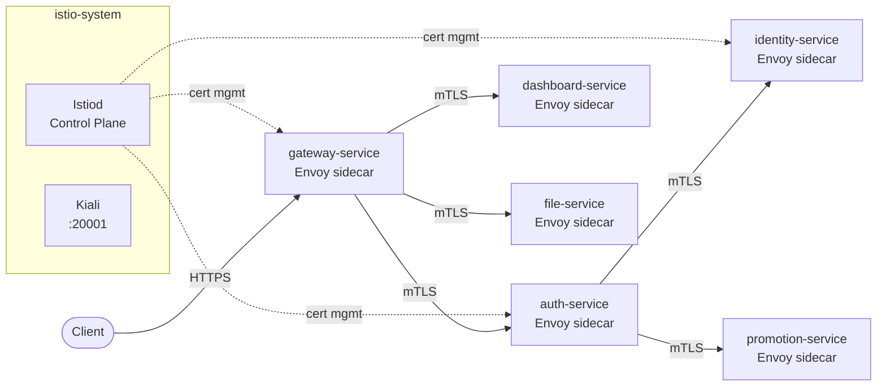

# Service Mesh — Istio + Kiali

## Implementación

CircleGuard usa **Istio** como service mesh para habilitar mTLS entre microservicios, circuit breakers declarativos, retry policies y despliegues canary con traffic shifting.

## Instalación

```bash
# Setup completo (instala Istio + Kiali + aplica todos los manifiestos)
bash scripts/ci/setup-mesh.sh stage
```

El script:
1. Descarga `istioctl` (si no está presente)
2. Instala Istio con perfil `minimal` (reduce consumo de RAM)
3. Habilita sidecar injection en `dev`, `stage` y `prod`
4. Aplica `PeerAuthentication` (mTLS STRICT)
5. Aplica `DestinationRules` (circuit breakers + connection pool)
6. Aplica `VirtualServices` (retries + canary weights)
7. Instala Kiali (visualización)
8. Reinicia los pods del namespace para inyectar el sidecar Envoy

## Manifiestos

| Archivo | Contenido |
|:---|:---|
| `k8s/mesh/peer-authentication.yaml` | mTLS STRICT en dev/stage/prod |
| `k8s/mesh/destination-rules.yaml` | Circuit breakers + connection pool por servicio |
| `k8s/mesh/virtual-services.yaml` | Retry policies + canary routing (90/10 en gateway) |
| `k8s/mesh/kiali.yaml` | Dashboard de visualización del mesh |

## mTLS entre servicios

Con `PeerAuthentication` en modo `STRICT`, todo el tráfico entre pods del mesh viaja cifrado con certificados X.509 gestionados por Istio. Los sidecars Envoy se encargan del TLS transparentemente para las aplicaciones.

```bash
# Verificar que mTLS está activo entre auth e identity
istioctl -n stage x describe pod $(kubectl -n stage get pod -l app=circleguard-auth-service -o name | head -1 | cut -d/ -f2)
```

## Circuit Breakers

Cada `DestinationRule` configura `outlierDetection`:

| Parámetro | Valor | Efecto |
|:---|:---|:---|
| `consecutiveGatewayErrors` | 5 | Abre el circuito tras 5 errores 5xx consecutivos |
| `interval` | 10s | Ventana de análisis |
| `baseEjectionTime` | 30s | Tiempo de expulsión del host |
| `maxEjectionPercent` | 50% | Máximo del pool que puede expulsarse |

## Canary Deployment — gateway-service

El `VirtualService` del gateway viene configurado con **90% stable / 10% canary** como ejemplo de traffic shifting:

```yaml
route:
  - destination:
      host: circleguard-gateway-service
      subset: stable
    weight: 90
  - destination:
      host: circleguard-gateway-service
      subset: canary
    weight: 10
```

### Flujo de promoción canary

```bash
# 1. Desplegar versión canary (con label version: canary)
kubectl -n stage set image deployment/circleguard-gateway-service-canary \
  gateway=diegoapolancol/circleguard-gateway-service:canary

# 2. Comenzar con 10% de tráfico (configuración por defecto)

# 3. Si métricas son buenas, aumentar a 50%
kubectl -n stage patch virtualservice circleguard-gateway-service \
  --type=json \
  -p='[{"op":"replace","path":"/spec/http/0/route/0/weight","value":50},
       {"op":"replace","path":"/spec/http/0/route/1/weight","value":50}]'

# 4. Promover canary a 100%
kubectl -n stage patch virtualservice circleguard-gateway-service \
  --type=json \
  -p='[{"op":"replace","path":"/spec/http/0/route/0/weight","value":0},
       {"op":"replace","path":"/spec/http/0/route/1/weight","value":100}]'

# 5. Rollback inmediato si hay problemas
kubectl -n stage patch virtualservice circleguard-gateway-service \
  --type=json \
  -p='[{"op":"replace","path":"/spec/http/0/route/0/weight","value":100},
       {"op":"replace","path":"/spec/http/0/route/1/weight","value":0}]'
```

## Retry Policies

Todos los `VirtualService` configuran reintentos automáticos:

```yaml
retries:
  attempts: 3
  perTryTimeout: 5s
  retryOn: gateway-error,connect-failure,retriable-4xx
```

## Kiali — Visualización

```bash
kubectl -n istio-system port-forward svc/kiali 20001:20001
# http://localhost:20001/kiali
```

Kiali conecta con:
- **Prometheus** (`monitoring` namespace) para métricas de tráfico
- **Jaeger** (`monitoring` namespace) para trazas distribuidas
- **Grafana** (`monitoring` namespace) para dashboards

Qué se puede ver en Kiali:
- Grafo del service mesh con latencias y error rates en tiempo real
- Estado del mTLS por servicio
- Configuración de VirtualServices y DestinationRules
- Trazas end-to-end de cada petición

## Diagrama del mesh


